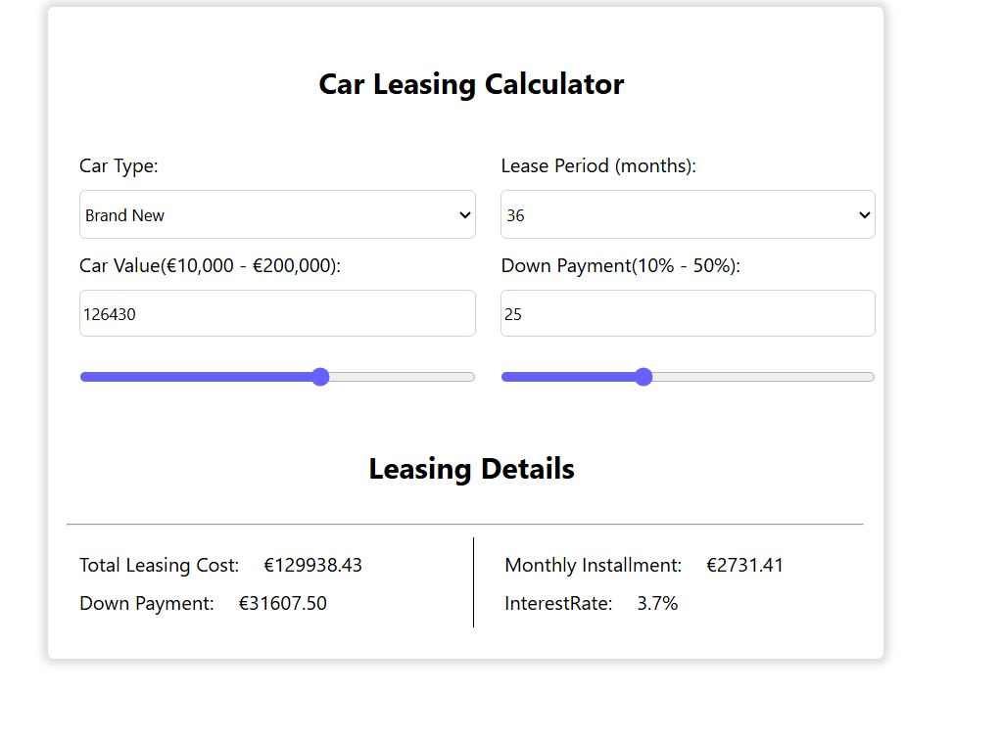
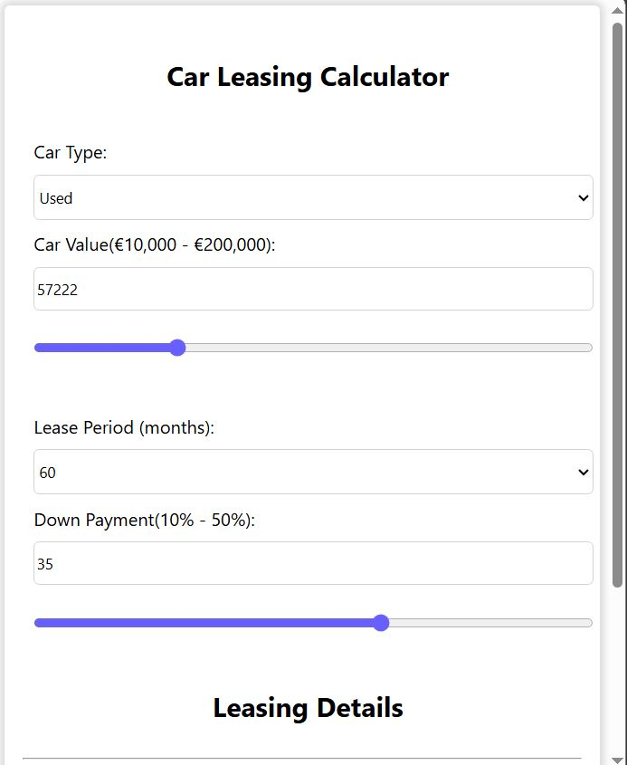
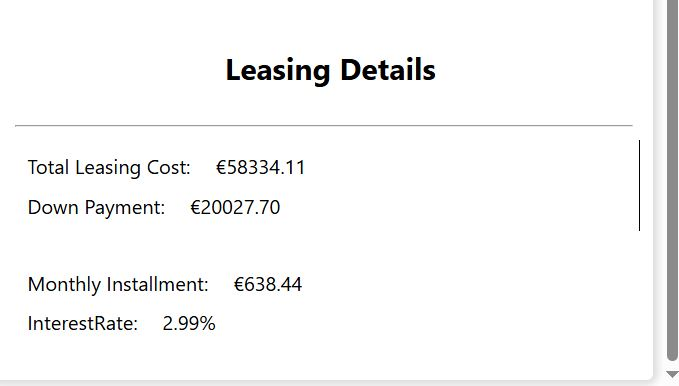
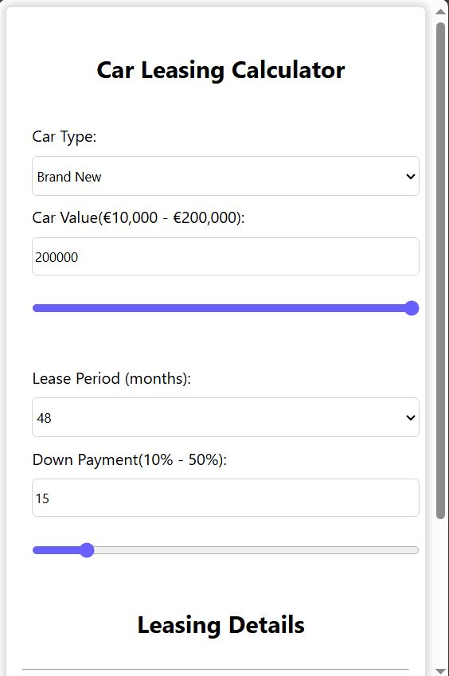
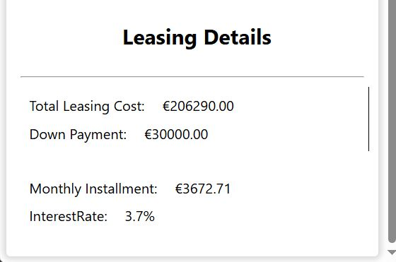

# Car Leasing Calculator

## Description of application

This is a simple application intended for users to easily recalculate car leasing. We used JavaScript, HTML and CSS to create this application. The user first selects the type of car (new or used), 
then selects the leasing period (12-60 months), then selects the value of the car, as well as the down payment percentage. 
After entering all these datas, the application calculates the total cost of leasing, the cost of the down payment, the amount of the monthly installment and the interest rate.

### 1. The first image shows the appearance of our application on large screens such as desktop screens.

### 2. The second and third images show the appearance of our application on smaller screens such as tablet screens.

   

### 3. The fourth and fifth images show the appearance of our application on smallest screens such as telaphone screens.

   

## Conclusion

As we can see, the application enables quick and easy calculation of car leasing, while it is suitable for use on different devices (phones, tablets, desktop computers), thanks to the flexible design from CSS, 
while we change the results in the fields for interest rate, monthly interest, total cost of leasing and down payment based on entered data achieved using JavaScript and querySelectors.
In order for our form to have an adequate structure, we used HTML.

